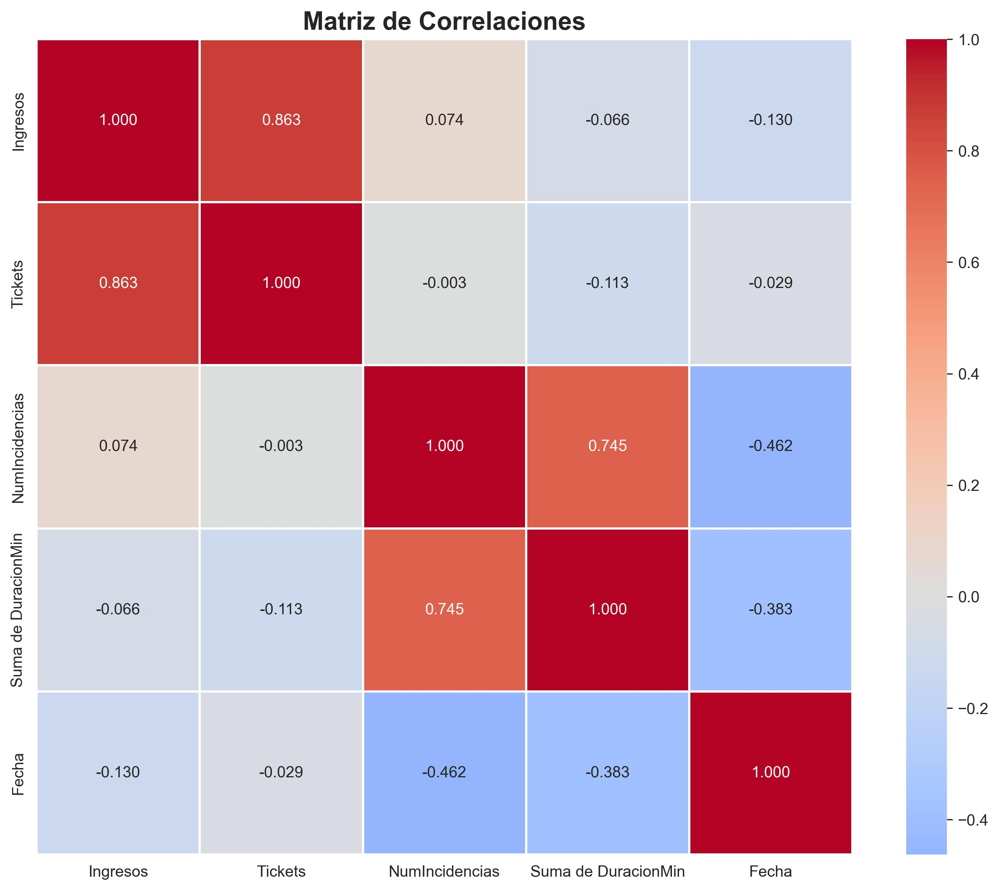
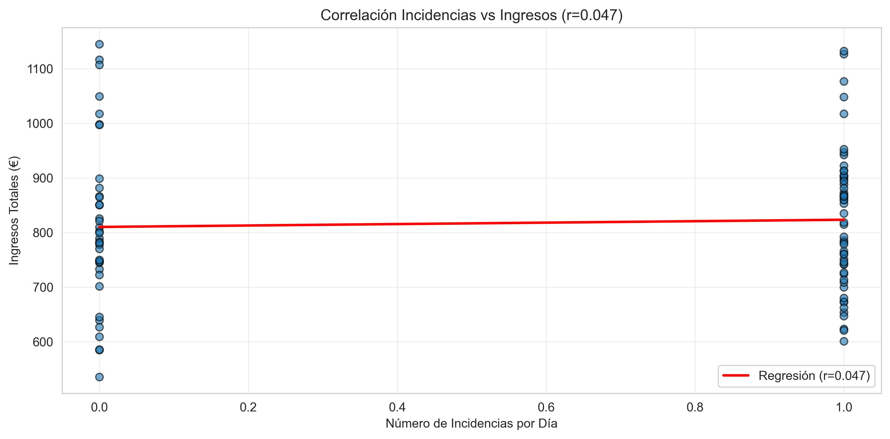
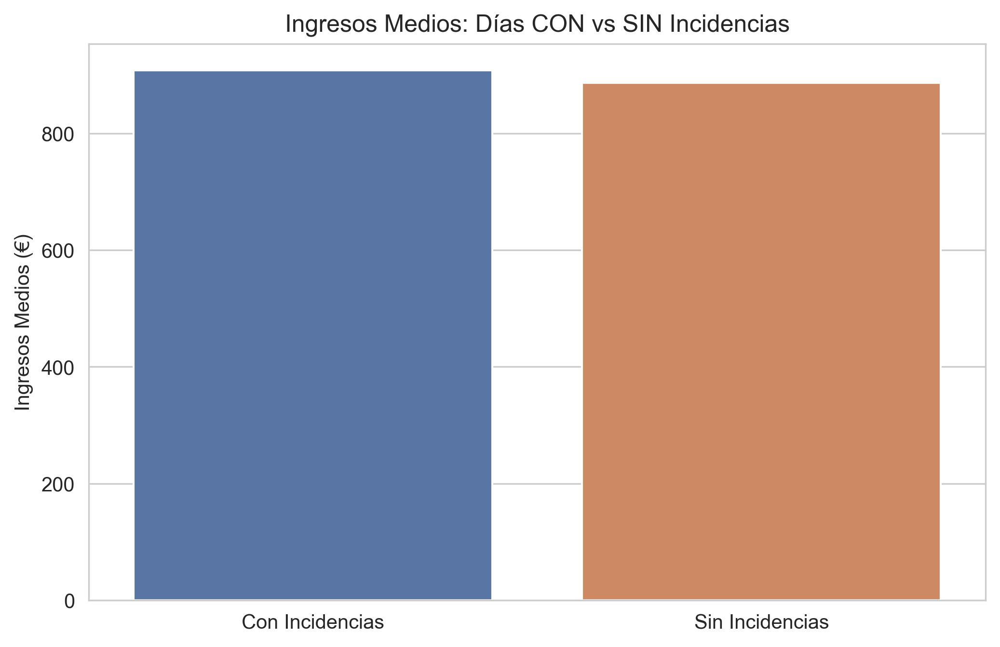
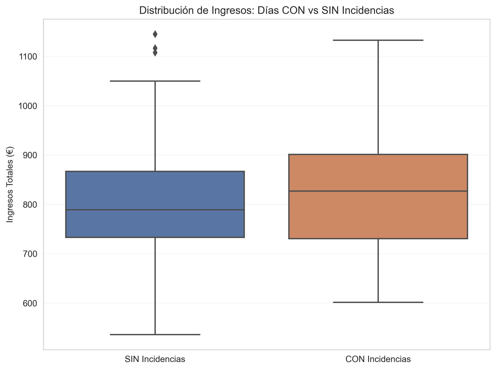
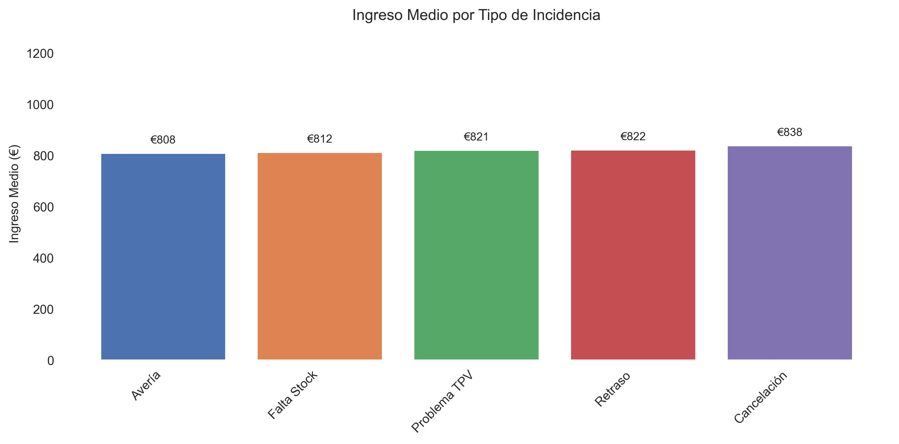
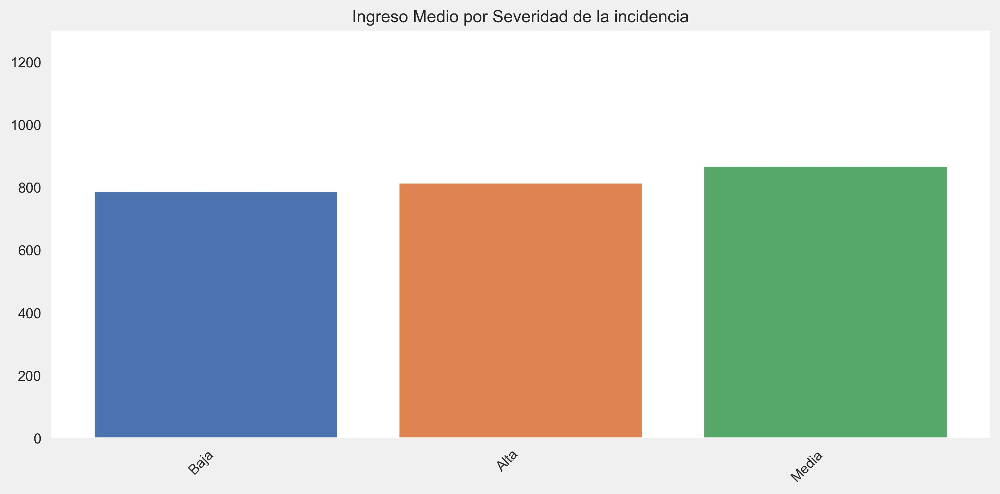

# Análisis del impacto de las Incidencias sobre los Ingresos

## Resumen ejecutivo
Este .md analiza la relación estadística entre las incidencias operacionales y los ingresos de ventas.

## Objetivo
- Determinar si existe correlación entre número de incidencias e ingresos por día.
- Determinar si existe diferencia estadística en ingresos en días CON vs SIN incidencias.
- Desglosar las Incidencias por tipo y por grado de severidad y ver si se encuentran diferencias entre las categorías.
- Cuantificar, si es posible, el efecto económico de las incidencias.

Para lograr los objetivos necesitamos centralizar los datos en una única tabla. Creamos una tabla con los datos de ingresos e incidencias agregados por día. La tabla es la siguiente:

| Fecha      | Ingresos | Tickets | NumIncidencias | Suma de DuracionMin | TieneIncidencia |
|------------|--------:|-------:|---------------:|--------------------:|----------------:|
| 2024-01-01 |  639.40 |     34 |            0.0 |                 0.0 |               0 |
| 2024-01-02 | 1,116.47|     50 |            0.0 |                 0.0 |               0 |
| 2024-01-03 |  761.36 |     37 |            1.0 |               148.0 |               1 |
| 2024-01-04 |  809.75 |     42 |            0.0 |                 0.0 |               0 |
| 2024-01-05 |  942.39 |     44 |            1.0 |               106.0 |               1 |

## Heatmap de Correlaciones
Antes de empezar con el análisis, hacemos una matriz de correlaciones para las siguientes covariables: Ingresos, Tickets, NumIncidencias, Suma de DuracionMin. De este modo podemos hacernos una idea de qué correlaciones puede ser interesante estudiar.

Observamos varias cosas interesantes: en contra de lo que cabría esperar, el número de incidencias al día no está inversamente relacionado con los ingresos, sino de forma directa. La suma total en minutos de las incidencias, por otro lado, sí que lo está. La fecha nos dice que, yendonos atrás en el tiempo los ingresos disminuirían, pero el coeficiente no es muy alto con lo que no debe ser significativo este hecho. 

La correlación entre tickets e ingresos es muy alta, pero no la vamos a estudiar porque es evidente que, a mayor número de tickets vendidos por día, mayores ingresos.

# ANÁLISIS

## 1. INCIDENCIAS VS INGRESOS 
### Análisis de correlación
Para determinar si hay correlación entre dos variables cuantitativas, lo primero es hacernos una idea visual enfrentándolas en una nube de puntos, siendo la Variable 1 el eje X y la Variable 2 el eje Y. De este modo, podemos saber qué tipo de prueba es la mejor para el análisis.

Se observa que la variable Incidencia es binaria, tomando sólo 0 y 1 como valores. No se puede usar el coeficiente de correlación Pearson.

Utilizaremos la prueba Point - biserial correlation, que es una variable de la prueba Pearson que se usa cuando una variable es continua y la otra binaria. También usaremos como referencia el test Spearman.

### Resultados

| Métrica | Valor |
|---:|:---|
| Point biserial correlation (r) | 0.0475 |
| p-value (point biserial) | 6.5484e-01 |
| Spearman (rho) | 0.0788 |
| p-value (Spearman) | 4.5791e-01 |

**📊 Conclusión:** **No significativa** — no hay evidencia de correlación entre incidencias e ingresos (p ≥ 0.05).

---

## 2. Días CON vs SIN Incidencias

Queremos determinar si hay diferencia significativa entre la media de ingresos en días con incidencias respecto a días sin incidencias. Al calcular las medias observamos que, en promedio, los días con incidencias presentan un incremento del 1.63 %.

### Comparación: Días CON vs SIN Incidencias

- 📈 Días CON incidencias  
  - Media: €823.37  
  - Desv. Est.: €126.35

- 📉 Días SIN incidencias  
  - Media: €810.19  
  - Desv. Est.: €152.79

**💰 IMPACTO ECONÓMICO**  
- Diferencia media: **€13.18 (+1.63%)**  
- Conclusión: ✓ Los días CON incidencias generan MÁS ingresos (posible confusión)

### Prueba a realizar
Aún con todo, queremos ver si existen estas diferencias significativas. Como tenemos dos muestras contínuas con media y varianza similar e independientes, usaremos el estadítico T para muestras independientes. Como referencia, también aplicaremos Mann-Whitney.

- Diseño: dos muestras independientes (Ingresos en días CON vs SIN incidencias).  
- Tests:  
  - T-test independiente (asumiendo medias y varianzas similares).  
  - Mann–Whitney U (prueba no paramétrica como contraste).  
- Hipótesis:  
  - H0: no hay diferencia en la media de ingresos entre ambos grupos.  
  - H1: existe diferencia en la media de ingresos.

---

### Prueba de Hipótesis: T-Test

| Test | Estadístico | p‑value |
|---|---:|---:|
| T‑test (paramétrico) | t = 0.4486 | 6.5484e-01 |
| Mann–Whitney U (no param.) | U = 1091.50 | 4.5727e-01 |

**Conclusión:** ✗ No rechazamos H0 (p ≥ 0.05). No hay evidencia de diferencia significativa en la media de ingresos entre días CON y SIN incidencias.

Como vemos, ese 1.63% de diferencia no es suficiente para afirmar que haya diferencia significativa entre los días con incidencias y los días en los que no la hay. Podemos decir, pues, que las incidencias no afectan, en el global de los datos, a los ingresos promedio. Podríamos, en un futuro, desglosar en categorías estos datos y aplicar, para cada caso, la prueba T. De este modo podríamos encontrar algún contexto de filtro (por ejemplo, cancelaciones en ferrocarriles en un mes donde haya habido inclemencias climáticas) en donde sí se noten estas diferencias de forma significativa.

---

### Visualización: Box Plot Comparativo

## 3. Por TIPO de Incidencia

### Prueba ANOVA

Como tenemos la lista de ingresos para cada tipo de incidencia, vamos a ver si hay diferencias significativas entre ellas. Para eso, utilizaremos la prueba ANOVA, ya que tenemos que comparar más de dos clases de datos.

Los resultados no son significativos, por lo que no podemos afirmar que haya diferencias significativas en los ingresos obtenidos en cada uno de los casos en los que hay una incidencia.

### Promedio de ingresos para cada tipo de incidencia

Como vemos, los promedios en ingresos para cada tipo de incidencia son muy similares

## 4. Por SEVERIDAD

### Análisis ANOVA de ingresos en función de la severidad de la incidencia

Los resultados siguen sin ser significativos, aunque el p-valor es más bajo que cuando no se tiene en cuenta la severidad de las incidencias.

### Ingresos promedio en función de la severidad de la incidencia

Resulta llamativo que los ingresos más bajos se obtengan cuando la severidad es más baja y que los más altos se den con severidad media.

## RESUMEN Ejecutivo de Hallazgos

No se han encontrado, por el momento, insights significativos. El volumen de datos de los que disponemos es todavía muy reducido; tal vez en el siguiente trimestre se puedan hallar insights.

---

## 📊 Datos generales
| Métrica | Valor |
|---|---:|
| Período analizado | 2024-01-01 — 2024-03-31 |
| Total días | 91 |
| Días con incidencias | 54 (59.3%) |
| Total incidencias | 54 |

## 💰 Impacto económico
| Métrica | Valor |
|---|---:|
| Ingresos días CON incidencias | €44,461.72 |
| Ingresos días SIN incidencias | €29,976.92 |
| Diferencia media diaria | **€13.18 (+1.63%)** |

## 📈 Correlación y significancia
| Métrica | Valor |
|---|---:|
| Pearson r | 0.0475 (p = 6.5484e-01) |
| Interpretación | Correlación débil positiva |
| Resultado pruebas | ✗ Diferencia NO significativa (p ≥ 0.05) — no evidencia de impacto |

## ⚠️ Tipo más problemático
- Avería — Ingreso medio: **€808.26**

## 🎯 Severidad más crítica
- Baja — Ingreso medio: **€787.87**

---

## Recomendaciones
- Acción inmediata (p. ej., priorizar X, recopilar más datos Y).
- Experimentos/validaciones a realizar.

## Reproducibilidad y visuales
- Las figuras clave están en `analysis/figures/` (p. ej. `fig_corr_matrix.png`, `fig_top_pairs.png`).
- Nota: los prints en notebooks pueden no verse en GitHub si los outputs no se guardan; por eso se recomienda exportar las figuras.

## Próximos pasos
- Lista corta de tareas siguientes (p. ej., probar modelo causal, análisis temporal).

## Anexos
- Código para reproducir (o enlace al notebook `notebooks/correlacion_impacto.ipynb`).