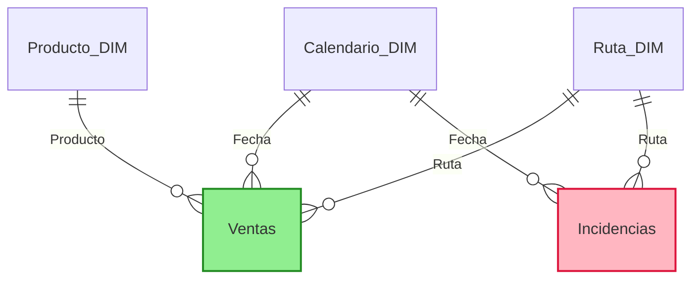

# Modelo de datos

- **Grano de Ventas**: día-ruta-producto. Usa `Fecha-Ruta` como clave técnica para evitar ambigüedades si hay rutas repetidas por día.
- **Grano de Incidencias**: día-ruta. Se vincula a DimCalendario y DimRuta, y se puede relacionar a FactVentas por `Fecha-Ruta` para analizar impacto en ventas.
- **Claves recomendadas**:
  - Calendario: `Fecha` (derivada de columnas Año/Día).
  - Ruta: `Ruta`.
  - Producto: `ProductoID` (y atributo `Producto` para la relación con el hecho si no hay ID en el hecho).
- **Relaciones sugeridas**: uno-a-muchos desde las dimensiones hacia los hechos, dirección de filtro bidireccional solo cuando sea necesario para analizar incidencias→ventas.
