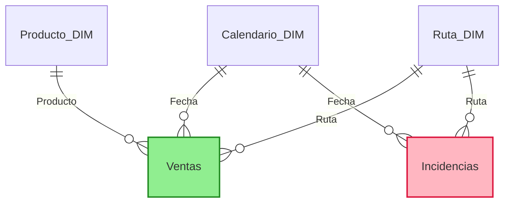

# Modelo de datos

- **Grano de Ventas**: La clave primaria es TicketID. El grano es Fecha - Ruta - Producto
- **Grano de Incidencias**: La clave primaria IncidenciaID. El grano es Fecha - Ruta
- **Claves recomendadas**:
  - Calendario: `Fecha` (derivada de columnas Año/Día).
  - Ruta: `Ruta`.
  - Producto: `ProductoID`.
- **Relaciones sugeridas**: 
  - Todas las relaciones son 1:∗ desde dimensiones hacia hechos (esquema estrella clásico).
  - Ambos hechos se relacionan con Calendario y Ruta, pero **no entre sí** (evita la problemática M:M).
  - Para analizar impacto de incidencias en ventas, usar medidas DAX con contexto compartido de Fecha y Ruta.
